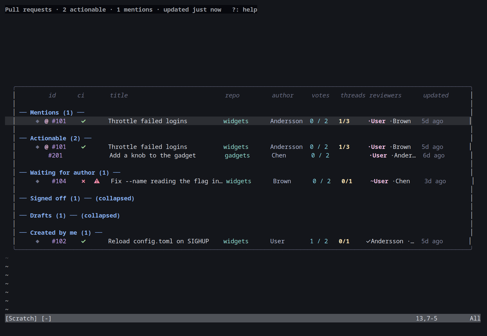
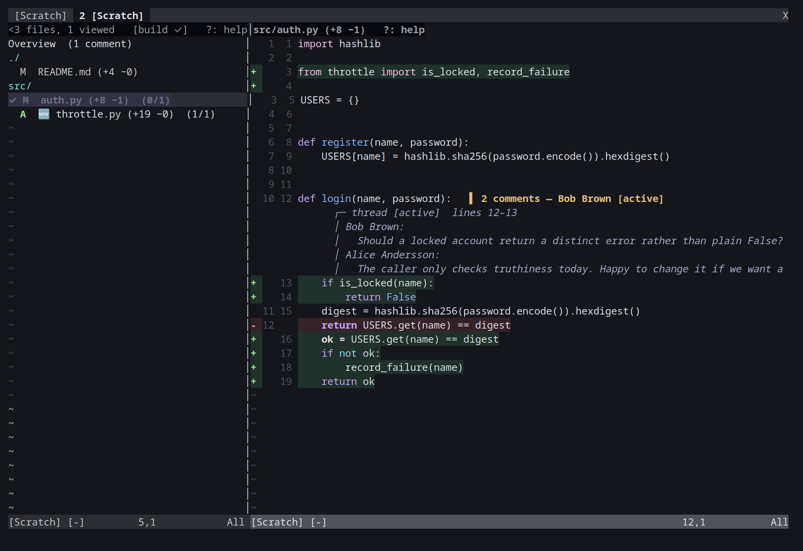
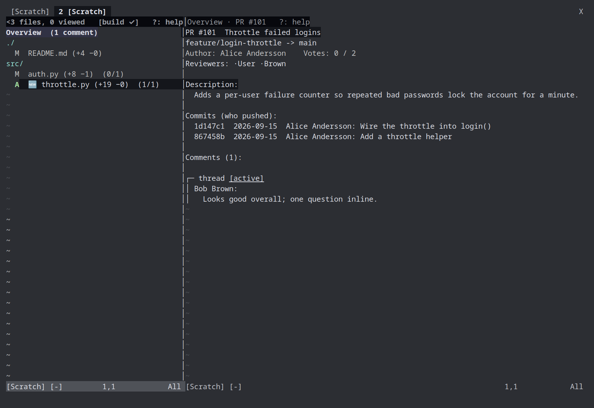
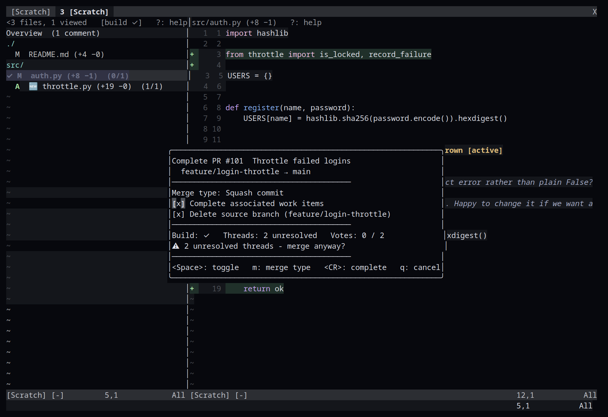
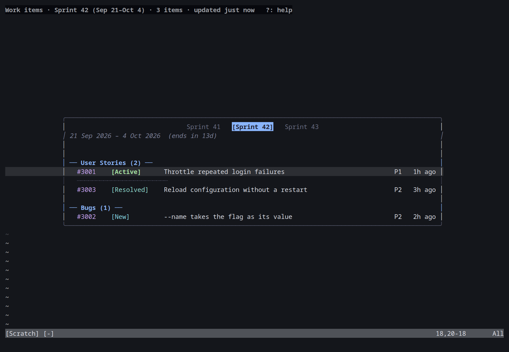

# azure-vicli

A terminal dashboard for Azure DevOps that lives entirely inside Neovim.

It shows the pull requests waiting on you, lets you review and comment on them
with vim navigation, and has a second dashboard for the work items assigned to
you in the current sprint. Everything a review needs is prefetched in the
background, so opening a PR, switching files, and jumping to a definition are
instant.



## Screenshots

<table>
<tr>
<td width="50%"><a href="docs/reviewer.md"></a><br><sub><b>Reviewer</b> - file list, old/new gutter, folded context, a thread expanded inline with <code>Tab</code>.</sub></td>
<td width="50%"><a href="docs/reviewer.md"></a><br><sub><b>Overview</b> - description, commits and PR-level comments, first row of every review.</sub></td>
</tr>
<tr>
<td width="50%"><a href="docs/reviewer.md"></a><br><sub><b>Complete</b> - merge type, toggles, and a warning when the build, threads or votes argue against merging.</sub></td>
<td width="50%"><a href="docs/work-items.md"></a><br><sub><b>Work items</b> - your sprint's stories and bugs, with tabs for the other sprints.</sub></td>
</tr>
</table>

_Every screenshot is generated from the test suite's [fake provider](docs/development.md#trying-it-without-azure-devops), so the people and PRs in them are made up._

## Contents

- [Screenshots](#screenshots)
- [Requirements](#requirements)
- [Install](#install)
- [Quick start](#quick-start)
- [What's in the box](#whats-in-the-box)
- [Running](#running)
- [License](#license)
- Docs: [dashboard](docs/dashboard.md) · [reviewer](docs/reviewer.md) ·
  [work items](docs/work-items.md) · [commands and keys](docs/commands-and-keys.md) ·
  [configuration](docs/configuration.md) · [troubleshooting](docs/troubleshooting.md) ·
  [development](docs/development.md)

## Requirements

- Windows, Linux or macOS.
- Neovim 0.9 or newer (0.11 recommended).
- Python 3.8 or newer. The data provider (`azure-cli.py`) uses only the
  standard library, so there is nothing to `pip install` and nothing to
  compile.
- git.
- bash, for `install.sh` and the standalone `azure-cli` launcher (Git for
  Windows provides one on Windows). The plugin install doesn't need it.
- An Azure DevOps personal access token (PAT) with Code read/write and Work
  Items read/write scopes, on every account in the config file. A PAT is
  always required; there is no Azure AD sign-in.

## Install

azure-vicli is both a standalone tool (its own launcher, its own Neovim
session - see [Running](#running)) and a regular Neovim plugin you can add
to an existing config and open with [`:AzureCli`](docs/commands-and-keys.md#commands) alongside
everything else you already have installed. Pick whichever fits how you
work; both read the same [config file](docs/configuration.md#configuration) and use the same
[data provider](docs/development.md#architecture).

### Standalone

```
git clone https://github.com/mosahadish/azure-vicli
cd azure-vicli
bash install.sh
```

`install.sh` checks or installs the dependencies (Neovim, git-bash, python),
creates the config file at its platform location with placeholders, and
opens it for editing. It is safe to re-run and never overwrites an existing
config. There's no build step - `azure-cli.py` runs directly.

### As a plugin

With [lazy.nvim](https://github.com/folke/lazy.nvim):

```lua
{
  "mosahadish/azure-vicli",
  cmd = "AzureCli",
  opts = {
    -- keys = { diff = { next_hunk = "]h" } },  -- see Keys below; optional
  },
}
```

`opts` (however you spell it for your plugin manager) is passed straight to
`require("azure-cli").setup()`; leaving it out (or the whole plugin
unconfigured beyond installing it) is fine too - every surface applies
[the defaults](docs/commands-and-keys.md#keys) until `setup()` says otherwise. `cmd = "AzureCli"`
lazy-loads the plugin on first use of the command (see
[Commands](docs/commands-and-keys.md#commands)); it has no side effects when merely installed, so
eager-loading it instead is just as safe if you'd rather.

With [packer.nvim](https://github.com/wbthomason/packer.nvim):

```lua
use({
  "mosahadish/azure-vicli",
  cmd = "AzureCli",
  config = function()
    require("azure-cli").setup({
      -- keys = { diff = { next_hunk = "]h" } },
    })
  end,
})
```

Either way, `azure-cli.py` (the data provider) still needs Python on `PATH`
- see [Requirements](#requirements) - and the [config file](docs/configuration.md#configuration)
still needs your account(s) filled in; `install.sh` isn't part of a plugin
install, so run it once from a clone if you want its dependency checks and
config-file scaffolding, or just create the config file by hand.

## Quick start

1. `bash install.sh` - checks Neovim, git and python, writes the config
   template and opens it. Fill in `org_url`, `project_name` and a PAT with
   Code (read & write) and Work Items (read & write) scopes.
2. `./azure-cli --doctor` - confirms the file parses and signs in to every
   organization in it. Inside Neovim the same check is `:AzureCli doctor`.
3. `./azure-cli` (or `:AzureCli` as a plugin) opens the dashboard. Press
   `?` on any screen for its keys.

## What's in the box

- **[Pull request dashboard](docs/dashboard.md)** - the PRs waiting on
  you, grouped by what they need, with build state, votes, unread activity
  and mentions; vote, complete and re-queue builds from the list.
- **[Reviewer](docs/reviewer.md)** - a two-pane review with an old/new
  gutter, folded context, inline threads, viewed-file tracking, comments
  and replies that appear instantly, batch review, "since my last review"
  and follow-up views, per-commit diffs and no-LSP code navigation.
- **[Work items](docs/work-items.md)** - your sprint's items with state,
  assignee, priority, sprint moves, discussion and PR links.
- **[Commands and keys](docs/commands-and-keys.md)** - every `:AzureCli`
  subcommand and every default key, all rebindable.
- **[Configuration](docs/configuration.md)** - the config file, `setup()`
  options and environment variables.
- **[Troubleshooting](docs/troubleshooting.md)** and
  **[how it works](docs/development.md)** (the daemon, the caches, the
  test suite, extending the reviewer).

## Running

This is the standalone launcher; installed as a plugin instead, use
[`:AzureCli`](docs/commands-and-keys.md#commands) (see [Install](#install)) - both open the same
dashboard.

```
./azure-cli          # Linux/macOS/git-bash
azure-cli.cmd         # Windows cmd.exe / PowerShell
```

`azure-cli`/`azure-cli.cmd` are thin launchers that run `azure-cli.py`
under `python3`/`python`. With no arguments they launch Neovim with the
dashboard. Headless flags exist for scripting (and work identically whether
you invoke `./azure-cli`, `azure-cli.cmd`, or `python3 azure-cli.py`
directly):

| Flag | Output |
|---|---|
| `--list` | Every relevant PR as newline-delimited JSON. |
| `--requeue <id>` | Re-queue expired or failed build validation for a PR. |
| `--print-pat --org <url> [--project <name>]` | The configured PAT for that account. |
| `--whoami --org <url> [--project <name>]` | The authenticated identity as JSON. |
| `--doctor [--json]` | Check the setup (config file, its fields, sign-in per organization, work items); exit 1 if anything fails. `--json` prints one object per check. |

## License

[MIT](LICENSE).
