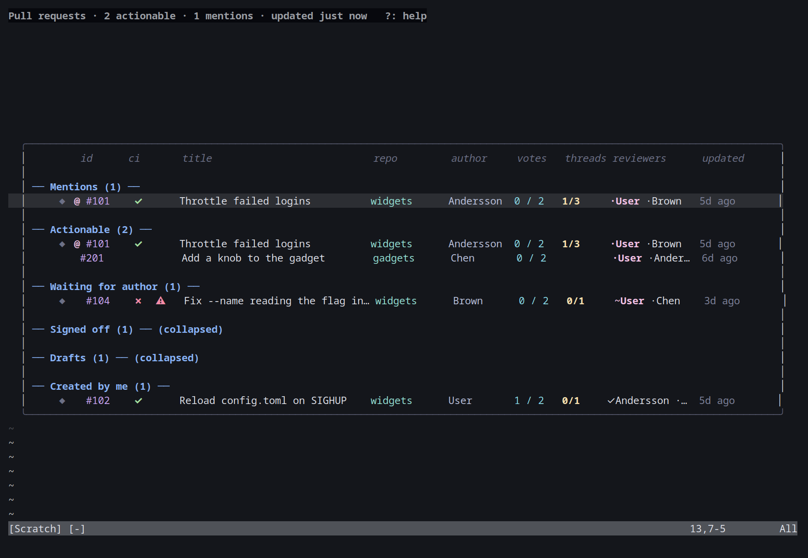

# Pull request dashboard

_Part of the [azure-vicli](../README.md) docs._

## Pull request dashboard

PRs are grouped into sections: Actionable, Waiting for author, Signed off,
Drafts, and Created by me. Within a section the most recently updated PR is
first. The list refreshes every minute.

A "Mentions" section at the top of the list collects every PR (from any of
the sections below) that has an active comment thread @-mentioning you; the
PR still appears in its normal section too, so nothing is hidden, just
surfaced twice. This only ever covers PRs already in the list - assigned to
you or created by you - since Azure DevOps has no API to search for PRs where
you're mentioned; a mention on a PR you're not a reviewer or author of won't
show up here.

Signed off and Drafts start collapsed (`── Signed off (5) ── (collapsed)`,
no rows shown) - configurable via `setup({collapsed_sections={...}})`, see
[setup() options](configuration.md#setup-options); Mentions/Actionable/Waiting/Created stay
open by default. `za` (or `<Space>`) on a section header toggles it, `zR` expands every
section and `zM` collapses every section; the state persists for the rest
of the session (even across a W/P dashboard swap). If the cursor's PR is in
a section that gets collapsed, the cursor lands on that section's header
instead of jumping elsewhere.

The winbar shows what's on screen instead of a key legend - `?` already
lists every key: `Pull requests · N actionable · M mentions   [filter: x]
[fetching repo…]   ?: help` - the two counts and both tags only appear when
they're non-zero/active (a filtered, non-syncing dashboard with nothing in
Actionable just shows `Pull requests   ?: help`).

The table's columns scale with the window instead of the fixed widths an
older version hard-coded: title and reviewer summary grow to fill a wide
terminal, id/badges/vote/thread-count stay fixed, and on a narrow one the
reviewer summary column drops first, then updated-human, then author (repo
and title just shrink towards their minimum instead of disappearing) - a
`[narrow]` winbar tag appears whenever a column had to be dropped. Resizing
the terminal re-renders immediately (`lua/azure-cli/ui.lua`'s `UI.layout`
solves the widths; see its own header comment for the exact rules).

| Key | Action |
|---|---|
| `j` / `k` | Move |
| `<CR>` | Open the PR in the reviewer, cloning its repo first if needed |
| `gd` | Show the description, build status and branch policies |
| `gy` | Copy the PR link |
| `o` | Open in the browser |
| `gb` | Open the PR's build in the browser |
| `/` | Filter by title, repo or author |
| `gv` | Vote |
| `gm` | Complete (merge) or set/cancel auto-complete - the same dialog as the reviewer's `gm`: merge type, whether to complete the linked work items, delete the source branch or auto-complete instead of completing now, and the build/threads/votes summary |
| `gr` | Re-queue build validation |
| `za` / `<Space>` | Toggle collapse on the section header under the cursor |
| `zR` | Expand every section |
| `zM` | Collapse every section |
| `gN` | Toggle desktop notifications for this session |
| `gO` | Open the config file |
| `r` | Refresh |
| `gW` | Pop up the work items linked to the PR - state, type, title and assignee - where `<CR>` opens one in the work-item detail view, `gs` changes its state, `gl` links another and `gL` unlinks the one under the cursor. A row shows its first linked item next to the title, e.g. `#3001` or `#3001 +1`, once they've been read in the background |
| `gl` / `gL` | Link a work item to the PR (a popup of your sprint's items, or type an id) / unlink one (a popup of its linked items). Both dashboards update straight away |
| `gX` | Run an [agent action](agents.md) on the PR in the background (Claude Code, Copilot, any command you configured), cancel a running one, or show its results |
| `gz` | Show the PR's agent results in a float; `<CR>` there opens them on the reviewer's Agent page |
| `W` | Switch to the work-items dashboard |
| `q` | Quit |

Press `?` for a popup with these keys plus the badge legend below.

Each row carries badges to the left of the id:

| Badge | Meaning |
|---|---|
| `●` | Unread comment or mention activity since you last opened the PR. On a PR you didn't author that includes one of your own threads being **resolved**, not just replied to - the threads column going `0/1` -> `1/1` is activity on your comment like any other, and `gu` in the reviewer will say whether the code near it actually moved |
| `⇣` | Branches or content being fetched in the background right now |
| `◆` | Fully prefetched; opens instantly |
| `◐` | An [agent action](agents.md) is running on the PR |
| `✦` | An agent result you haven't looked at yet (`gz`) |
| `@` | An active thread mentions you; the PR also appears under Mentions |

The build column to the right of the id shows `✓` succeeded, `✗` failed,
`↻` expired, and `●` running with the queue position when known. `⚠` marks a
merge conflict and `A` marks auto-complete.

`gd`'s description popup also shows a "Build:" line (status and, when known,
a link to the build behind it) and a "Policies:" section listing the PR's
other branch policies (required reviewers, minimum reviewer count, work item
linking, comment requirements, ...) as `✓`/`✗`/`…` for approved/rejected or
broken/queued or running, with a "Waiting on:" line naming the required
reviewers who haven't approved yet when that's known.

Votes, completion and auto-complete apply to the row immediately and are
reverted with an error if the call fails.

A column header row sits above the first section, the cursor line is
highlighted, and `<CR>` on a section header folds or unfolds it. The winbar
also says when the list was last fetched (`updated 3m ago`) and shows a
`[refreshing…]` tag while a poll is in flight; a poll that fails leaves the
list on screen and flashes the error instead of replacing the table.

`/` filters the list as you type - by id, title, repo or author - `<CR>`
keeps the filter and `<Esc>` clears it; the filter survives switching to
the work-items dashboard and back. Your own entry in the reviewer-summary
column is highlighted, so "have I voted on this one?" needs no scanning for
your surname, and `gd` lists the branches, author, an absolute timestamp,
every reviewer's vote (you marked) and the PR's URL above the description.

Every menu this tool shows (votes, work-item states, ...) goes through
`vim.ui.select`, so a picker plugin such as telescope, fzf-lua or
dressing.nvim draws it when installed; the current value is marked
`(current)`. Completing a PR opens a small dialog instead (see
[Reviewer](reviewer.md#reviewer)'s `gm`): the merge type, whether the linked
work items are completed and the source branch deleted (both on by
default), whether to set auto-complete instead of completing now, and the
build state, unresolved thread count and votes, with a warning when any of
them argue against merging.

### Desktop notifications

A new comment on a PR you authored, a reply on a thread you took part in,
one of your own threads being resolved, or a fresh @-mention fires an
OS-level "toast" alongside the in-Neovim
`vim.notify` - so activity surfaces even when Neovim isn't the focused
window. It uses PowerShell's WinRT toast API on Windows, `notify-send` on
Linux, and `osascript` on macOS; a missing backend is silently a no-op. Press
`gN` to toggle notifications off or on for the rest of the session, or set
`AZVICLI_TOASTS=0` in the environment to disable them permanently.
