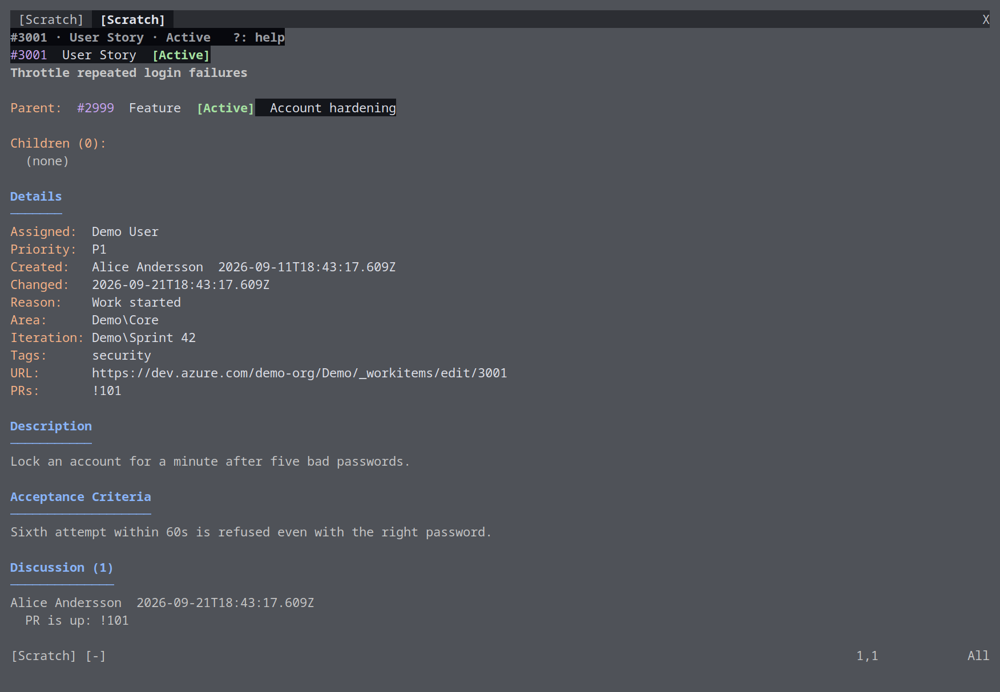

# Work items

_Part of the [azure-vicli](../README.md) docs._

## Work items

Press `W` in the PR dashboard. The work-items dashboard shows the user stories
and bugs assigned to you in the current sprint, with tabs for the other
sprints of the quarter (or, with `work_items.sprint_scope: all`, every sprint
the team has - see below). Its winbar is `Work items · Sprint 42 (Sep 1–14) ·
N items   ?: help`; the detail view's is `#123 · type · state   ?: help`.

| Key | Action |
|---|---|
| `<CR>` | Open the item: parent, children, description |
| `gs` | Change the item's state, with the allowed transitions and reasons |
| `n` | New work item: type, title, and parent (if the cursor is on one) |
| `ga` | Assign the item under the cursor (empty input = assign to me) |
| `gp` | Set the item's priority (1-4) |
| `ge` | Edit the item's title |
| `gi` | Move the item to another sprint of the quarter |
| `gl` | Link a pull request to the item under the cursor |
| `[` / `]` | Previous / next sprint (also `<S-Tab>` / `<Tab>`) |
| `{n}gt` | Jump to sprint n |
| `r` | Refresh |
| `P` | Back to the PR dashboard |
| `q` | Quit |

Press `?` for a popup with these keys. `ga`, `gp`, `ge` and `gi` apply to the
row immediately and are reverted with an error if the call fails, the same
optimistic pattern the PR dashboard uses for votes and completion. `n` has no
id to show until the server answers, so it notifies and reloads the active
sprint's list instead.

In the detail view `<CR>` on a parent or child opens it, `gs` changes state,
`ga`/`gp`/`ge`/`gi` edit assignee/priority/title/sprint (re-rendering the
detail on success), `o` opens the browser, `<BS>` returns to the list, and
`?` shows its keys. It also shows the item's discussion and any linked pull
requests: `gc` posts a comment (shown at once, tagged "(sending…)" until the
server confirms), `gl` links a pull request by id - resolving its org,
project and repository from the PR dashboard's cache when it's known there,
otherwise prompting for the repository name - and `gL` unlinks one, picked
from the item's current links. `gl` is also available on the dashboard, for
the item under the cursor. The discussion list comes from a REST endpoint
some older on-prem TFS instances don't expose; there the item still loads
normally, with the discussion showing as empty instead of failing the fetch.

The collection and project are the configured account's `org_url` and
`project_name` (see [Configuration](configuration.md#configuration)); team, assignee and item
types come from that same account's `work_items:` block - `team` is required
to enable this dashboard at all, `assignee` defaults to your own signed-in
display name, and `types` defaults to `User Story, Bug`. Every one of these
can still be overridden with the `AZVICLI_WI_*` variables listed below, and
`AZVICLI_WI_ACCOUNT` picks a different account's `work_items:` block when
more than one account has one. With no `work_items:` block configured
anywhere and no `AZVICLI_WI_TEAM` override, this dashboard shows that
diagnostic in its buffer instead of any work items.

Sections (and the `n` type picker) follow `work_items.types:` - configure
`types: [Task, Feature]` and you get Tasks and Features sections instead
of the default User Stories and Bugs. `/` filters by id, title, state or
assignee as you type (`<Esc>` clears). `ga` picks from the team's members
(plus "(me)" and typing a name), `gl` picks from the PR dashboard's cached
list (or takes an id), and `gL` unlinks from the dashboard as well as the
detail view. An empty description shows `(none)`.

### States and sprint scope

`work_items.states:` (see [Configuration](configuration.md#configuration)) is an ordered
list of the states this account's work items can be in - order is rank
(first = most actionable, sorted to the top of each section) and also picks
the `[state]` token's colour by position: 1st → `AzureCliWiNew`, 2nd →
`AzureCliWiActive`, last → `AzureCliWiRemoved`, second-to-last →
`AzureCliWiClosed`, everything else → `AzureCliWiImplemented`. A state a
work item reports that isn't in the list ranks last with a neutral colour
(`AzureCliWiOther`) rather than colliding with a configured one. Left
unconfigured, both dashboards use the exact rank/colour mapping they always
have (`Active`/`In Progress` first, then `New`, `Implemented`, `Resolved`,
`Closed`, `Removed` last) - nothing changes for an existing install. The
mapping itself lives in `lua/azure-cli/workitems/states.lua`, shared by
`workitems/dashboard.lua` and `workitems/view.lua`.

`work_items.sprint_scope:` picks what the tab bar shows: `parent` (default)
is today's behaviour - tabs are the siblings under the current sprint's
parent node (typically a quarter or release). `all` widens that to every
iteration the team has at all, ordered by start date with the current one
still focused. The tab bar shows a window of tabs around the active one
(with `‹`/`›` markers) whenever there are more than fit the window width, so
`all` scope's usually-longer list is handled the same way a wide `parent`
group already was.
