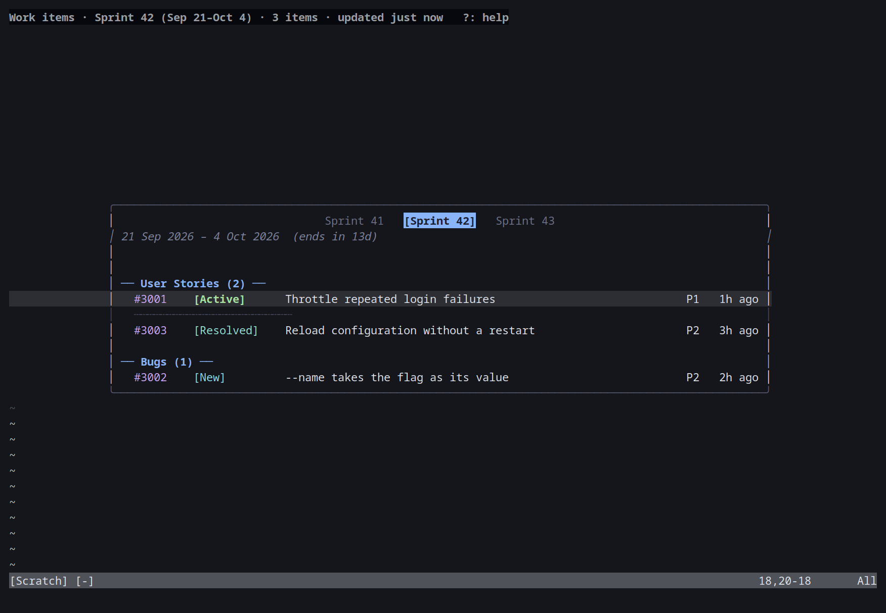
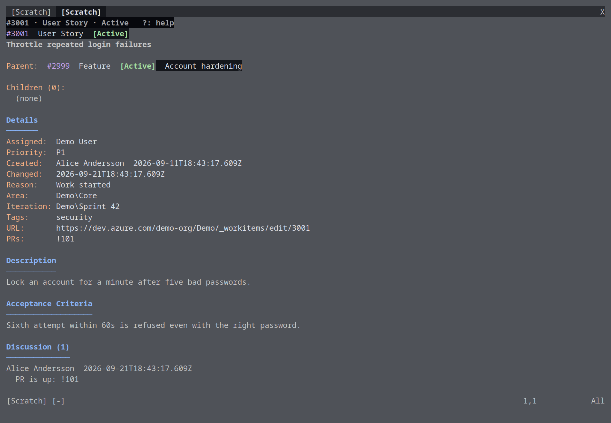

# Work items

_Part of the [azure-vicli](../README.md) docs._

## Work items

Press `W` in the PR dashboard. The work-items dashboard shows the user stories
and bugs assigned to you in the current sprint, with tabs for the other
sprints of the quarter (or, with `work_items.sprint_scope: all`, every sprint
the team has - see below). Its winbar is `Work items · Sprint 42 (Sep 1–14) ·
N items   ?: help`; the detail view's is `#123 · type · state   ?: help`.





| Key | Action |
|---|---|
| `<CR>` | Open the item: parent, children, description |
| `gs` | Change the item's state in a popup, optionally for its children too (see below) |
| `n` | New work item: type, title, and parent (if the cursor is on one) |
| `ga` | Assign the item under the cursor (empty input = assign to me) |
| `gp` | Set the item's priority (1-4) |
| `ge` | Edit the item's title |
| `gi` | Move the item to another sprint of the quarter |
| `gl` | Link a pull request to the item under the cursor |
| `T` | Tree view: everything under each item indented beneath it (remembered) |
| `za` or `<Space>` / `zR` / `zM` | Tree: fold/unfold an item's children / unfold all / fold all |
| `gR` | Open a pull request linked to the item (a picker when there are several) |
| `[` / `]` | Previous / next sprint (also `<S-Tab>` / `<Tab>`) |
| `{n}gt` | Jump to sprint n |
| `r` | Refresh |
| `P` | Back to the PR dashboard |
| `gq` | Show/hide the [chat panel](chat.md); the agent knows which work item is under the cursor ("create a branch from develop for this work item") |
| `q` | Quit |

Press `?` for a popup with these keys. `ga`, `gp`, `ge` and `gi` apply to the
row immediately and are reverted with an error if the call fails, the same
optimistic pattern the PR dashboard uses for votes and completion. `n` has no
id to show until the server answers, so it notifies and reloads the active
sprint's list instead.

### Tree view (`T`)

`T` shows everything under each item indented beneath it (children, their
children, and so on), the way the Azure DevOps taskboard groups tasks under
their story:

```
── User Stories (2) ──
 ▾#3001    [Active]      Throttle repeated login failures   P1   1/3 done !101 1h ago
  ├ #3011   [In Progress] Count failed logins per account   Alice Andersson
  ├ #3013   [Done]        Design the lockout rule           Alice Andersson
  └▾#3012   [To Do]       Tests for the lockout window      0/1 done  Alice Andersson
    └ #3014   [To Do]       Cover the sixth attempt         Bob Brown
```

Everything under an item is fetched whatever its type or assignee, in one
recursive query, so a story's tasks show even when someone else has them;
those rows show the assignee in place of the priority and age. (On a server
that won't run the recursive query, only direct children are shown.) An
item whose parent is also in the list moves under that parent instead of
having its own row. Every key works on a child row too (`gs`, `<CR>`, `ga`,
...). The filter keeps a parent when it or anything under it matches.

`za` (or `<Space>`) folds or unfolds the children of the item under the cursor (▾ open,
▸ folded); on a child row it folds that child's parent and moves to it.
`zR` unfolds everything and `zM` folds everything. `T` again turns the tree
off. Whether it's on is remembered between sessions.

### Progress

An item with children shows how many are finished, e.g. `1/3 done`, with
or without the tree. A child counts as done when its state is in the
Completed category (Done, Closed); removed children aren't counted. The
count turns green once everything is done.

### Changing state (`gs`)

`gs` opens a popup, from the list or the detail view:

```
Set #3001  User Story · Active
  Throttle repeated login failures

State:   ‹ Implemented ›   (1/4)
Reason:  ‹ (default reason) ›

[ ] Also set children (1 of 3)
    [ ] #3011 Task  In Progress  (already In Progress)  Count failed logins per account
    [ ] #3012 Task  To Do → In Progress  Tests for the lockout window
    [ ] #3013 Task  Done → In Progress  Design the lockout rule

<Space>/l, h: cycle or toggle   <CR>: apply   q: close
```

`State` offers only the states the item's workflow allows from its current
one, and `Reason` the reasons ADO has recorded for that transition (plus
the default and a free-text choice). Move the cursor to a row and cycle it
with `<Space>`/`l` (forward) or `h` (back).

"Also set children" starts unchecked. Children are often another type with
their own state names (a Task has no "Resolved"), so each child is mapped
by the state's category (Proposed, In Progress, Resolved, Completed,
Removed): the same state if that child can move to it, otherwise the state
in the same category it can move to. A child already there, or with no
state in that category, is listed with the reason and can't be checked.
Children that would move backwards (a Done task when the story goes back
to Active) or that were removed start unchecked, but `<Space>` on a child
checks it. `<Space>` on a child while the box is off picks just that child.

**Several items at once:** select rows with `V` and press `gs`. The first
selected item chooses the state and reason; every other selected item is
listed under "Also set the other selected items" with the state it would
move to, mapped the same way as children below, and starts checked. One of
the same type going to the same state gets the same reason; the rest get
their type's default.

`<CR>` sets the item first and, only if that succeeds, its checked children,
each with its type's default reason. A child that fails is reported on its
own; the item's change stands. Grandchildren are included too, indented
under their parent, and mapped the same way.

### Linked pull requests

A row with linked pull requests shows them after its priority: `!101`, or
`!101 +2` when there are more. The detail view lists each one under **Pull
Requests** with its status (active, draft, completed, abandoned), title,
repository, branches and author:

```
Pull Requests (1)
─────────────────
  !101    active     Throttle failed logins
           widgets  feature/login-throttle → main  ·  Alice Andersson
```

`gR` opens a linked PR, from the list or the detail view (`<CR>` on one of
those lines in the detail view does the same). It opens in the reviewer when
the PR dashboard's list has that PR, which is where the reviewer gets the
PR's details. Otherwise, for example a completed PR or one you're not on, it
opens in the browser. A PR the server won't return (deleted, or no access)
is still listed, by its id alone.

Linking works from either side, each through a popup picker (`<CR>` picks, `q` closes): `gl`/`gL` here link and unlink a PR on the item, and `gl`/`gL` on the PR dashboard or in the reviewer link and unlink a work item on the PR. Either way both dashboards, and an open detail view, show the change straight away.

In the detail view `<CR>` on a parent or child opens it, `gs` changes state,
`ga`/`gp`/`ge`/`gi` edit assignee/priority/title/sprint (re-rendering the
detail on success), `o` opens the browser, `<BS>` returns to the list, and
`?` shows its keys. It also shows the item's discussion and linked pull
requests (above): `gc` posts a comment (shown at once, tagged "(sending…)" until the
server confirms), `gl` links a pull request by id - resolving its org,
project and repository from the PR dashboard's cache when it's known there,
otherwise prompting for the repository name - and `gL` unlinks one, picked
from the item's current links. `gl` is also available on the dashboard, for
the item under the cursor. The discussion list comes from a REST endpoint
some older on-prem TFS instances don't expose; there the item still loads
normally, with the discussion showing as empty instead of failing the fetch.

The collection and project are the configured account's `org_url` and
`project_name` (see [Configuration](configuration.md#configuration)); team, assignee and item
types come from that same account's `work_items:` block - `team` is required
to enable this dashboard at all, `assignee` defaults to your own signed-in
display name, and `types` defaults to `User Story, Bug`. Every one of these
can still be overridden with the `AZVICLI_WI_*` variables listed below, and
`AZVICLI_WI_ACCOUNT` picks a different account's `work_items:` block when
more than one account has one. With no `work_items:` block configured
anywhere and no `AZVICLI_WI_TEAM` override, this dashboard shows that
diagnostic in its buffer instead of any work items.

Sections (and the `n` type picker) follow `work_items.types:` - configure
`types: [Task, Feature]` and you get Tasks and Features sections instead
of the default User Stories and Bugs. `/` filters by id, title, state or
assignee as you type (`<Esc>` clears). `ga` picks from the team's members
(plus "(me)" and typing a name), `gl` picks from the PR dashboard's cached
list (or takes an id), and `gL` unlinks from the dashboard as well as the
detail view. An empty description shows `(none)`.

### States and sprint scope

`work_items.states:` (see [Configuration](configuration.md#configuration)) is an ordered
list of the states this account's work items can be in - order is rank
(first = most actionable, sorted to the top of each section) and also picks
the `[state]` token's colour by position: 1st → `AzureCliWiNew`, 2nd →
`AzureCliWiActive`, last → `AzureCliWiRemoved`, second-to-last →
`AzureCliWiClosed`, everything else → `AzureCliWiImplemented`. A state a
work item reports that isn't in the list ranks last with a neutral colour
(`AzureCliWiOther`) rather than colliding with a configured one. Left
unconfigured, both dashboards use the exact rank/colour mapping they always
have (`Active`/`In Progress` first, then `New`, `Implemented`, `Resolved`,
`Closed`, `Removed` last) - nothing changes for an existing install. The
mapping itself lives in `lua/azure-cli/workitems/states.lua`, shared by
`workitems/dashboard.lua` and `workitems/view.lua`.

`work_items.sprint_scope:` picks what the tab bar shows: `parent` (default)
is today's behaviour - tabs are the siblings under the current sprint's
parent node (typically a quarter or release). `all` widens that to every
iteration the team has at all, ordered by start date with the current one
still focused. The tab bar shows a window of tabs around the active one
(with `‹`/`›` markers) whenever there are more than fit the window width, so
`all` scope's usually-longer list is handled the same way a wide `parent`
group already was.
